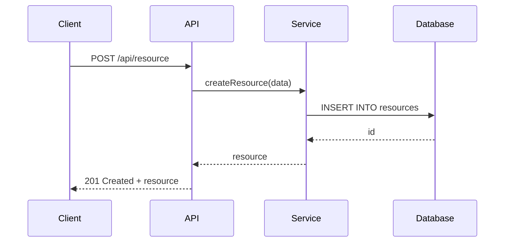

# Detailed Design

You are creating detailed design specifications based on the architecture design. This includes API specifications, data models, database schemas, and component interfaces.

## Core Principles

- **Precision**: Be specific about interfaces, data formats, and behaviors
- **Consistency**: Follow established patterns and conventions
- **Completeness**: Cover all necessary details for implementation
- **Testability**: Design with testing in mind

---

## Phase 1: Architecture Review

**Goal**: Review architecture and understand what needs detailed design

Input: $ARGUMENTS

**Actions**:
1. Create a todo list to track design progress
2. Review the architecture design document
3. Identify components that need detailed design
4. List out API endpoints, data models, and interfaces needed

---

## Phase 2: API Specification Design

**Goal**: Design REST/gRPC API endpoints

**Actions**:
1. For each API endpoint, specify:
   - HTTP method/URL or gRPC service
   - Request/response format
   - Error handling
   - Authentication/authorization

**API Specification Template**:
```markdown
## API: [API Name]

### Endpoint
```http
[METHOD] /api/[version]/[resource]
```

### Description
[Brief description of what this endpoint does]

### Request

**Headers**:
```http
Authorization: Bearer <token>
Content-Type: application/json
```

**Body**:
```json
{
  "field1": "value1",
  "field2": "value2"
}
```

### Response

**Success (200 OK)**:
```json
{
  "status": "success",
  "data": {
    "id": "uuid",
    "field1": "value1",
    "field2": "value2"
  }
}
```

**Error (400 Bad Request)**:
```json
{
  "status": "error",
  "message": "Validation failed",
  "errors": [
    {
      "field": "field1",
      "message": "Field is required"
    }
  ]
}
```

### Errors
- `400` - Bad Request: Invalid input
- `401` - Unauthorized: Missing or invalid token
- `403` - Forbidden: Insufficient permissions
- `404` - Not Found: Resource doesn't exist
- `500` - Internal Server Error: Unexpected error
```

---

## Phase 3: Data Model Design

**Goal**: Define data models and relationships

**Actions**:
1. For each data model, specify:
   - Fields and data types
   - Relationships with other models
   - Validation rules
   - Indexes

**Data Model Template**:
```markdown
## Data Model: [Model Name]

### Fields

| Field | Type | Required | Description | Constraints |
|-------|------|----------|-------------|-------------|
| `id` | UUID | Yes | Primary key | Auto-generated |
| `name` | String | Yes | Name of the item | 1-255 chars |
| `description` | Text | No | Description | - |
| `status` | Enum | Yes | Current status | `draft`, `active`, `archived` |
| `created_at` | DateTime | Yes | Creation time | Auto-set |
| `updated_at` | DateTime | Yes | Last update time | Auto-update |

### Relationships

| Relation | Type | Related Model | Description |
|----------|------|----------------|-------------|
| `user` | Many-to-One | User | Created by user |
| `items` | One-to-Many | Item | Related items |

### Validation Rules
- Name must be unique
- Status transitions: `draft` → `active` → `archived`
- Created_by cannot be changed after creation

### Indexes
- `index_user_id`: On `user_id`
- `index_status`: On `status`
- `index_created_at`: On `created_at`
```

---

## Phase 4: Database Schema Design

**Goal**: Design database schema

**Actions**:
1. Create SQL schema or ORM model definitions
2. Specify migrations if this is an existing database
3. Define constraints, indexes, and triggers

**Database Schema Template**:
```sql
-- Table: [table_name]
CREATE TABLE [table_name] (
    id UUID PRIMARY KEY DEFAULT gen_random_uuid(),
    name VARCHAR(255) NOT NULL,
    description TEXT,
    status VARCHAR(50) NOT NULL CHECK (status IN ('draft', 'active', 'archived')),
    user_id UUID NOT NULL REFERENCES users(id),
    created_at TIMESTAMPTZ NOT NULL DEFAULT NOW(),
    updated_at TIMESTAMPTZ NOT NULL DEFAULT NOW(),
    UNIQUE(name, user_id)
);

-- Indexes
CREATE INDEX idx_[table_name]_user_id ON [table_name](user_id);
CREATE INDEX idx_[table_name]_status ON [table_name](status);
CREATE INDEX idx_[table_name]_created_at ON [table_name](created_at);

-- Trigger for updated_at
CREATE TRIGGER update_[table_name]_updated_at
    BEFORE UPDATE ON [table_name]
    FOR EACH ROW EXECUTE FUNCTION update_updated_at_column();
```

---

## Phase 5: Component Interface Design

**Goal**: Define interfaces between components

**Actions**:
1. For each component interface, specify:
   - Methods/functions
   - Parameters and return types
   - Error conditions
   - Usage examples

**Component Interface Template**:
```markdown
## Component: [Component Name]

### Interface

```typescript
interface [ComponentName] {
  /**
   * [Brief description of method]
   *
   * @param param1 - [Description of param1]
   * @param param2 - [Description of param2]
   * @returns [Description of return value]
   * @throws [ErrorType] - [When error is thrown]
   */
  methodName(param1: Type1, param2: Type2): Promise<ReturnType>;
}
```

### Implementation Notes
- [Note 1]
- [Note 2]
- [Note 3]

### Usage Example
```typescript
const component = new [ComponentName]();
const result = await component.methodName(param1, param2);
```
```

---

## Phase 6: Sequence Diagrams

**Goal**: Visualize component interactions

**Actions**:
1. Create sequence diagrams for key flows
2. Show data flow between components
3. Document happy paths and error paths

**Sequence Diagram Template**:


---

## Phase 7: Document Generation

**Goal**: Generate comprehensive design document

**Actions**:
1. Compile all design into a detailed design document
2. Include all API specs, data models, schemas, and interfaces
3. Add diagrams and examples
4. Save as `docs/design/detailed-design.md`

---

## Best Practices

1. **Follow conventions**: Adhere to team's style guides and patterns
2. **Be specific**: Avoid ambiguity - specify exactly what's expected
3. **Include examples**: Show usage examples for APIs and interfaces
4. **Think about errors**: Document error conditions and how to handle them
5. **Version designs**: Track changes to design documents
6. **Get feedback**: Share with developers before implementation

---

## Output Format

Your final deliverable should include:
- API specifications for all endpoints
- Data models and relationships
- Database schema with migrations
- Component interfaces
- Sequence diagrams for key flows
- Complete design document

Mark all todos complete once design is finalized.
