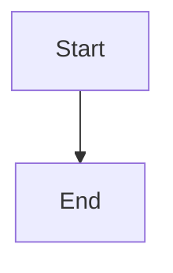

# Document Generator Skill

## Purpose

Automatically generate well-structured, timestamped documentation from phase outputs, ensuring consistent formatting and organization.

## When to Use

Activate this skill when:
- Completing a workflow phase that requires documentation
- Need to generate standardized documentation
- Exporting phase results to documents
- Creating project documentation with proper versioning

## Core Capabilities

### 1. Document Generation
- Generate markdown documents from phase outputs
- Apply document templates
- Include metadata and versioning
- Add headers, footers, and change logs

### 2. File Organization
- Create timestamp-based filenames
- Organize into appropriate subdirectories
- Auto-create directory structure
- Maintain document history

### 3. Content Formatting
- Apply consistent markdown formatting
- Generate tables, lists, code blocks
- Include diagrams (ASCII art, mermaid)
- Add cross-references

### 4. Metadata Management
- Document versioning
- Author attribution
- Phase tracking
- Status indicators

## Document Templates

### Requirements Document Template

```markdown
# Requirements Document - {{project_name}}

> **Document Info**
>
> - **Version**: {{version}}
> - **Date**: {{date}}
> - **Authors**: {{authors}}
> - **Status**: {{status}}

---

## Overview

{{overview}}

## Functional Requirements

{{functional_requirements}}

## Non-Functional Requirements

{{non_functional_requirements}}

## Constraints

{{constraints}}

## Assumptions

{{assumptions}}

## Success Criteria

{{success_criteria}}

---

**Change History**

| Date | Version | Author | Changes |
|------|---------|--------|---------|
| {{date}} | {{version}} | {{authors}} | Initial |
```

### Architecture Document Template

```markdown
# Architecture Design - {{project_name}}

> **Document Info**
>
> - **Version**: {{version}}
> - **Date**: {{date}}
> - **Architect**: {{authors}}
> - **Status**: {{status}}

---

## Executive Summary

{{executive_summary}}

## System Architecture

```
[System Architecture Diagram]
```

## Components

{{components_description}}

## Technology Stack

- **Language**: {{language}}
- **Framework**: {{framework}}
- **Database**: {{database}}

## Architecture Decision Records

{{adrs}}

---

**Change History**

| Date | Version | Author | Changes |
|------|---------|--------|---------|
| {{date}} | {{version}} | {{authors}} | Initial |
```

## File Naming Convention

### Pattern

```
{{phase}}_{{timestamp}}.md
```

### Examples

- `requirements_20260321_143000.md`
- `architecture_20260321_150530.md`
- `detail_design_20260321_163045.md`

### Format

- **Timestamp Format**: `%Y%m%d_%H%M%S`
- **Example**: `20260321_143000` = March 21, 2026, 14:30:00

## Directory Structure

```
docs/
├── requirements/           # Requirements documents
│   └── requirements_{{timestamp}}.md
├── architecture/          # Architecture documents
│   ├── architecture_{{timestamp}}.md
│   └── adr/              # Architecture Decision Records
├── design/               # Detailed design documents
│   ├── detail_design_{{timestamp}}.md
│   ├── api/             # API specifications
│   └── database/        # Database schemas
├── implementation/       # Implementation notes
│   └── implementation_notes_{{timestamp}}.md
├── testing/             # Test reports
│   └── test_report_{{timestamp}}.md
├── review/              # Code review reports
│   └── code_review_{{timestamp}}.md
├── user/                # User documentation
│   └── user_guide_{{timestamp}}.md
└── performance/         # Performance reports
    ├── performance_analysis_{{timestamp}}.md
    ├── optimization_plan_{{timestamp}}.md
    ├── benchmark_results_{{timestamp}}.md
    └── performance_validation_{{timestamp}}.md
```

## Generation Process

### Step 1: Collect Phase Output

Gather all outputs from the completed phase:
- Key decisions
- Requirements lists
- Design diagrams
- Code snippets
- Test results
- Action items

### Step 2: Apply Template

Apply the appropriate document template:
1. Load template for phase
2. Fill in metadata (date, version, authors)
3. Insert phase content
4. Format sections

### Step 3: Generate Filename

Create timestamp-based filename:
```python
from datetime import datetime

timestamp = datetime.now().strftime("%Y%m%d_%H%M%S")
filename = f"{phase}_{timestamp}.md"
```

### Step 4: Create Directory

Ensure output directory exists:
```bash
mkdir -p docs/{{phase}}/
```

### Step 5: Write Document

Write document to file with proper formatting:
```python
with open(f"docs/{phase}/{filename}", "w") as f:
    f.write(document_content)
```

### Step 6: Update Index

Update document index if enabled:
```markdown
# Document Index

## Requirements
- [Requirements]({{filename}})

## Architecture
- [Architecture Design]({{filename}})
```

## Metadata Schema

### Document Metadata

```yaml
metadata:
  project: "{{project_name}}"
  phase: "{{phase}}"
  version: "{{version}}"
  date: "{{date}}"
  timestamp: "{{timestamp}}"
  authors: ["{{author1}}", "{{author2}}"]
  status: "draft|review|approved|published"
  tags:
    - "{{tag1}}"
    - "{{tag2}}"
```

### Version History

```yaml
history:
  - version: "1.0.0"
    date: "2026-03-21"
    author: "John Doe"
    changes:
      - "Initial version"
```

## Output Format Specification

### Markdown Format

- **File Extension**: `.md`
- **Line Width**: 120 characters
- **Code Blocks**: Triple backticks with language
- **Tables**: GitHub Flavored Markdown
- **Task Lists**: `- [ ]` for unchecked, `- [x]` for checked
- **Front Matter**: YAML metadata

### Code Block Examples

````
```language
code here
```
```

### Table Format

```markdown
| Column 1 | Column 2 | Column 3 |
|----------|----------|----------|
| Data 1   | Data 2   | Data 3   |
```

### Diagram Format

**Mermaid Diagrams:**
`````

```
```

**ASCII Art Diagrams:**
```
+-------------------+
|   Component       |
+-------------------+
|                   |
|   Functionality   |
|                   |
+-------------------+
```

## Best Practices

### Content Organization
1. Use clear section headers
2. Provide table of contents for long documents
3. Use consistent terminology
4. Include diagrams where helpful
5. Add code examples

### Version Control
1. Commit all generated documents
2. Use descriptive commit messages
3. Tag important document versions
4. Maintain document history

### Accessibility
1. Use descriptive link text
2. Provide alt text for diagrams
3. Use proper heading hierarchy
4. Ensure sufficient contrast

## Automation

### CLI Command

```bash
# Generate document for phase
/doc generate --phase requirements --output docs/

# Generate all documents
/doc generate --all

# Update index
/doc index update

# Validate documents
/doc validate
```

### Integration with Workflow

```yaml
# workflow.yaml
phases:
  - id: "requirements"
    output:
      type: "document"
      format: "markdown"
      path: "docs/requirements/"
      filename: "requirements_{{timestamp}}.md"
      auto_generate: true
```

## Examples

### Example 1: Requirements Document

```bash
# After requirements phase
/doc generate --phase requirements

# Output:
# docs/requirements/requirements_20260321_143000.md
```

**File Content:**
```markdown
# Requirements Document - My Project

> Version: 1.0.0
> Date: 2026-03-21
> Authors: [John Doe, Jane Smith]
> Status: Draft

## Overview

This document outlines the requirements for My Project...

## Functional Requirements

1. User Authentication
   - REQ-001: Users must be able to register
   - REQ-002: Users must be able to login
...
```

### Example 2: Architecture Document

```bash
# After architecture phase
/doc generate --phase architecture-design

# Output:
# docs/architecture/architecture_20260321_150530.md
```

### Example 3: Batch Generation

```bash
# Generate all documents
/doc generate --all --output docs/

# Output:
# docs/requirements/requirements_20260321_143000.md
# docs/architecture/architecture_20260321_150530.md
# docs/design/detail_design_20260321_163045.md
...
```

## Quality Checks

### Document Validation

Check generated documents for:
- [ ] Proper markdown formatting
- [ ] Valid metadata
- [ ] Correct file naming
- [ ] Proper directory placement
- [ ] Included in index
- [ ] Version history present

### Common Issues

**Issue 1: Missing Sections**
- Verify template is complete
- Check phase output has all required data

**Issue 2: Formatting Errors**
- Validate markdown syntax
- Check special characters are escaped

**Issue 3: Broken Links**
- Verify internal links work
- Check cross-references

## Troubleshooting

### Document Not Generated

1. Check phase completed successfully
2. Verify template exists
3. Check output directory permissions
4. Review error logs

### Wrong Filename

1. Verify timestamp format
2. Check naming pattern configuration
3. Ensure no conflicting files

### Index Not Updated

1. Check index generation enabled
2. Verify write permissions
3. Review index template

## Integration

### With Git

```bash
# Generate and commit
/doc generate --phase requirements
git add docs/requirements/
git commit -m "docs: add requirements document"
```

### With CI/CD

```yaml
# .github/workflows/docs.yml
name: Generate Documentation

on:
  workflow_complete:

jobs:
  docs:
    runs-on: ubuntu-latest
    steps:
      - uses: actions/checkout@v3
      - name: Generate docs
        run: /doc generate --all
      - name: Commit docs
        run: |
          git config user.name "Doc Bot"
          git add docs/
          git commit -m "docs: auto-generate documentation"
          git push
```

## Advanced Features

### Template Variables

Available variables:
- `{{project_name}}`
- `{{phase}}`
- `{{timestamp}}`
- `{{date}}`
- `{{version}}`
- `{{authors}}`
- `{{status}}`

### Custom Templates

Create custom templates:
```markdown
<!-- templates/docs/custom.md -->
# {{title}}

Generated on {{date}} by {{authors}}

## Content

{{content}}

## Metadata

- Phase: {{phase}}
- Version: {{version}}
```

### Document Transformation

Transform between formats:
```bash
# Markdown to HTML
/doc transform --format html --input docs/requirements/requirements_20260321_143000.md

# Markdown to PDF
/doc transform --format pdf --input docs/requirements/requirements_20260321_143000.md
```

## Related Skills

- **Requirements Clarification**: Provides content for requirements docs
- **Architecture Design**: Provides content for architecture docs
- **Detail Design**: Provides content for design docs
- **Code Development**: Provides content for implementation notes
- **Testing**: Provides content for test reports
